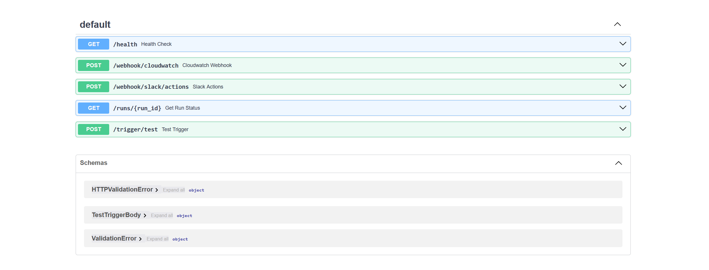
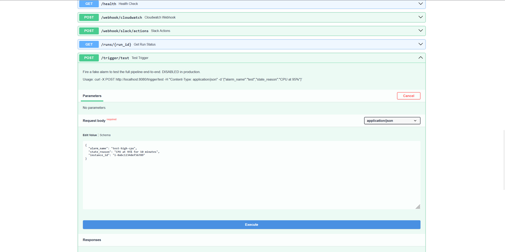
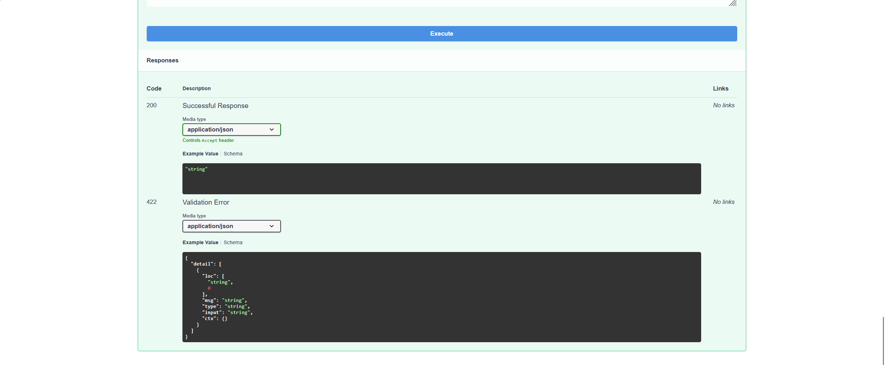
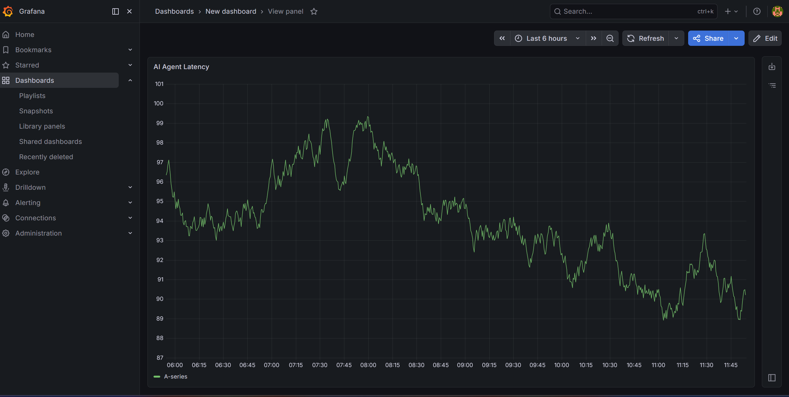
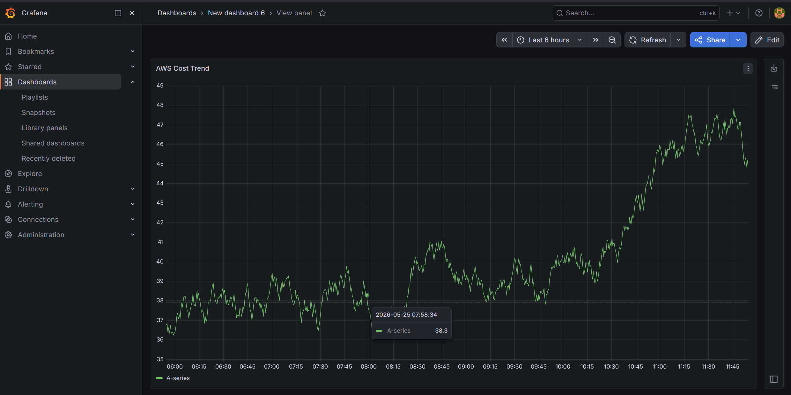
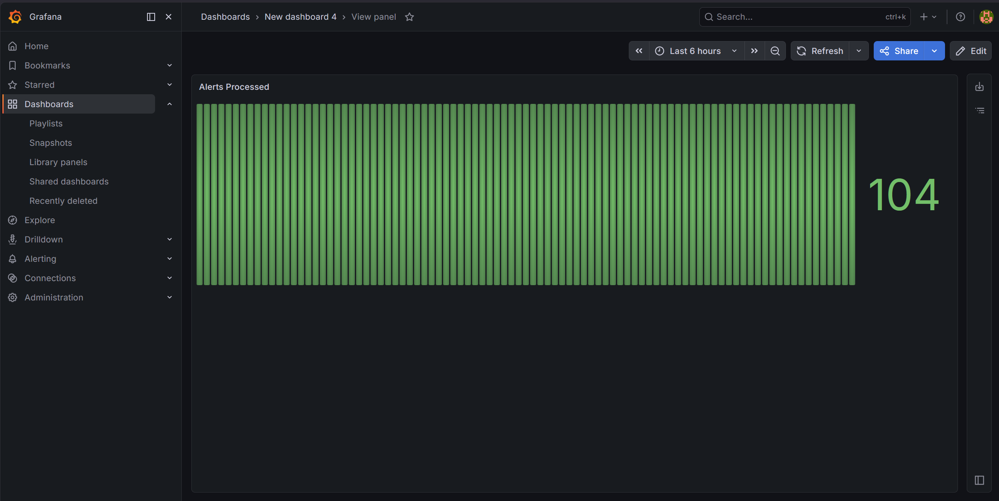
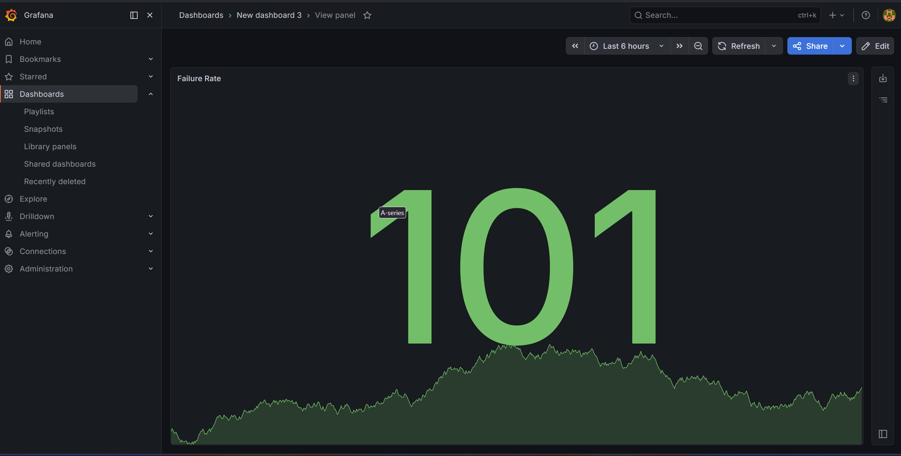
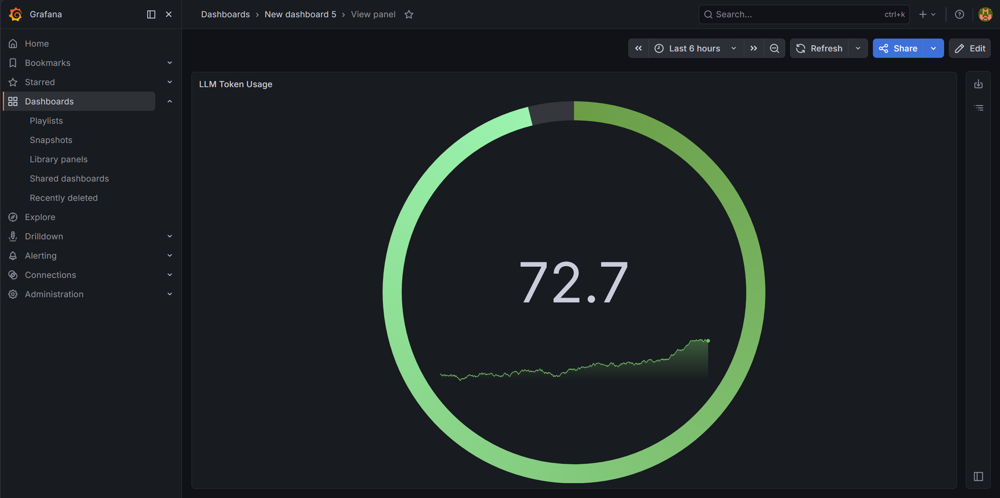
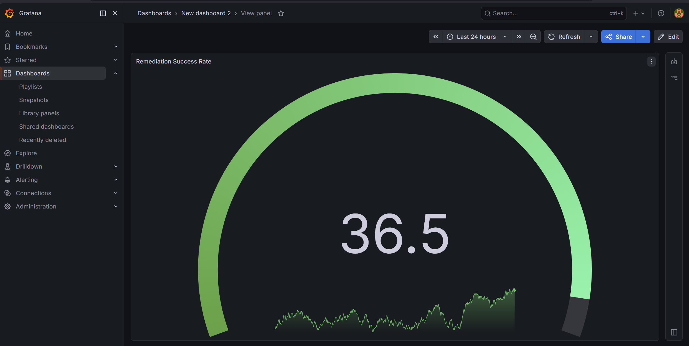

# Autonomous CloudOps AI Platform

## 📌 Overview

Autonomous CloudOps AI Platform is an AI-driven cloud operations and observability system designed to automate cloud incident analysis, troubleshooting, monitoring, and remediation workflows.

The platform combines:

- Retrieval-Augmented Generation (RAG)
- Multi-Agent AI orchestration using LangGraph
- FastAPI backend services
- AWS cloud infrastructure
- Grafana observability dashboards
- Docker containerization
- Kubernetes deployment workflows

The system simulates how modern enterprise CloudOps/SRE teams automate incident response pipelines using AI agents and cloud-native infrastructure.

-------------------------------------------------------------------------------------------------------------

# 🎥 Live Project Demonstration

## Full Working Demo Video

[Watch Autonomous CloudOps AI Platform Demo]  

(https://drive.google.com/file/d/1Zje8l1uIW45qLUn0nWP6Aw56BLSBObe1/view?usp=drive_link)

This demo showcases:

- FastAPI Swagger API workflows
- CloudWatch alert ingestion
- LangGraph AI orchestration
- RAG-based diagnostics pipeline
- Grafana observability dashboards
- AI-powered remediation flow
- Infrastructure automation lifecycle

# 📸 Platform Screenshots

## Swagger API Interface

### API Endpoints


### Test Trigger Endpoint


### API Response Validation


---

## Grafana Observability Dashboards

### AI Agent Latency


### AWS Cost Trend


### Alerts Processed


### Failure Rate Dashboard


### LLM Token Usage


### Remediation Success Rate

----------------------------------------------------------------------------------------------------------------
# 🚀 Key Features

## ✅ AI-Powered Incident Analysis
Automatically analyzes cloud alerts, logs, and infrastructure anomalies using LLM-powered reasoning workflows.

## ✅ RAG-Based Troubleshooting
Retrieves contextual cloud documentation, logs, and operational knowledge from vector databases for intelligent diagnosis.

## ✅ Multi-Agent Workflow Orchestration
Uses LangGraph to coordinate specialized AI agents responsible for:
- Ingestion
- Analysis
- Planning
- Remediation
- Reporting
- Cost optimization

## ✅ FastAPI Backend APIs
Exposes cloud automation workflows through REST APIs and interactive Swagger documentation.

## ✅ Cloud Monitoring & Observability
Integrated observability pipelines using:
- Grafana dashboards
- OpenTelemetry
- CloudWatch monitoring

## ✅ Infrastructure as Code
Provisioned AWS infrastructure using Terraform modules.

## ✅ Kubernetes-Native Deployment
Supports containerized deployment using:
- Docker
- Helm charts
- ArgoCD
- AWS EKS

-------------------------------------------------------------------------------------------------------------

# 🧠 Problem Statement

Modern cloud systems generate massive amounts of:
- logs
- alerts
- incidents
- infrastructure events

Manual cloud operations require engineers to:
- investigate alerts
- search logs
- analyze metrics
- identify root causes
- plan remediation

This process is:
- time-consuming
- repetitive
- expensive
- error-prone

This platform automates those workflows using AI-powered orchestration and retrieval systems.

------------------------------------------------------------------------------------------------------------

# 🏗️ System Architecture

```text
                    ┌────────────────────────────┐
                    │   Cloud Alerts / Logs      │
                    └────────────┬───────────────┘
                                 │
                                 ▼
                    ┌────────────────────────────┐
                    │     FastAPI Backend API    │
                    └────────────┬───────────────┘
                                 │
                                 ▼
                    ┌────────────────────────────┐
                    │  LangGraph AI Orchestrator │
                    └────────────┬───────────────┘
                                 │
        ┌────────────────────────┼────────────────────────┐
        ▼                        ▼                        ▼
 ┌─────────────┐        ┌─────────────┐         ┌─────────────┐
 │ Ingest Node │        │ Analyze Node│         │ Plan Node   │
 └──────┬──────┘        └──────┬──────┘         └──────┬──────┘
        │                      │                       │
        ▼                      ▼                       ▼
 ┌────────────────────────────────────────────────────────────┐
 │        Pinecone RAG + AWS Docs + Operational Logs         │
 └────────────────────────────────────────────────────────────┘
                                 │
                                 ▼
                    ┌────────────────────────────┐
                    │ Remediation + Report Layer │
                    └────────────┬───────────────┘
                                 │
                                 ▼
                    ┌────────────────────────────┐
                    │ Grafana + CloudWatch       │
                    │ Observability Dashboard    │
                    └────────────────────────────┘
```

```

 🔄 Workflow

## Step 1 — Alert Trigger
A cloud monitoring alert or test trigger is sent to the FastAPI backend.

Example:
- High CPU utilization
- Memory spikes
- Pod crashes
- Infrastructure anomalies

---

## Step 2 — Ingestion Pipeline
The ingestion node collects:
- cloud logs
- alert metadata
- operational context
- AWS documentation

---

## Step 3 — RAG Retrieval
Relevant cloud knowledge is retrieved using:
- embeddings
- vector similarity search
- Pinecone vector database

This provides contextual information to the AI system.

---

## Step 4 — AI Analysis
LangGraph agents coordinate reasoning workflows to:
- analyze incidents
- identify root causes
- determine severity
- generate recommendations

---

## Step 5 — Planning & Remediation
The planning agent generates remediation workflows such as:
- restarting services
- scaling infrastructure
- suggesting fixes
- optimization recommendations

---

## Step 6 — Reporting & Observability
The system generates:
- operational reports
- telemetry data
- monitoring dashboards
- execution logs

using Grafana and OpenTelemetry integrations.

---

# 🛠️ Technologies Used

| Category | Technologies |
|---|---|
| Backend | FastAPI, Python |
| AI Orchestration | LangGraph |
| LLM Integration | OpenAI APIs |
| RAG Pipeline | Pinecone, Embeddings |
| Cloud Infrastructure | AWS |
| Containerization | Docker |
| Kubernetes | EKS, Helm |
| GitOps | ArgoCD |
| Monitoring | Grafana, CloudWatch |
| Telemetry | OpenTelemetry |
| IaC | Terraform |

---
`
# 📂 Project Structure

```text
CLOUDOPS-AGENT/
│
├── .github/
│   └── workflows/
│       ├── ci.yml.yml
│       ├── deploy-prod.yml.yml
│       └── deploy-staging.yml.yml
│
├── agent/
│   ├── graph.py
│   ├── state.py
│   ├── __init__.py
│   │
│   └── nodes/
│       ├── analyze_node.py
│       ├── approval_node.py
│       ├── cost_optimizer_node.py
│       ├── ingest_node.py
│       ├── plan_node.py
│       ├── remediate_node.py
│       ├── report_node.py
│       └── __init__.py
│
├── api/
│   ├── main.py
│   ├── slack_setup.py
│   └── __init__.py
│
├── alerts/
│   └── __init__.py
│
├── argocd/
│   └── cloudops-agent-app.yaml
│
├── helm/
│   ├── values.yaml
│   │
│   └── agent/
│       └── templates/
│           └── deployment.yaml
│
├── infra/
│   ├── cloudwatch_main.tf
│   ├── eks_main.tf
│   ├── iam_main.tf
│   ├── main.tf
│   ├── variables.tf
│   ├── vpc_main.tf
│   │
│   ├── grafana/
│   │   └── grafana_dashboard.json.json
│   │
│   └── .terraform/
│       ├── modules/
│       └── providers/
│
├── ingestion/
│   └── __init__.py
│
├── observability/
│   ├── telemetry.py
│   └── otel_collector.yaml
│
├── rag/
│   ├── diagnosis_engine.py
│   ├── embedder.py
│   ├── ingest_aws_docs.py
│   ├── live_log_ingestor.py
│   ├── log_fetcher.py
│   ├── query_engine.py
│   ├── setup_indexes.py
│   ├── logging.json
│   └── __init__.py
│
├── remediation/
│
├── tests/
│   ├── advanced_demo.py
│   ├── test_agent.py
│   ├── test_api.py
│   └── test_phase6.py
│
├── Dockerfile
├── pyproject.toml
├── aws_secrets_setup.sh
├── secrets_management.py
├── test_imports.py
│
├── PHASE2_COMMANDS.sh
├── PHASE5_COMMANDS.sh
└── PHASE6_COMMANDS.sh
```

-----------------------------------------------------------------------------------------------------------------
````

---

 📌 Important Components
 
| Component | Purpose |
|---|---|
| `agent/` | AI orchestration workflows using LangGraph |
| `rag/` | Retrieval-Augmented Generation pipeline |
| `api/` | FastAPI backend services |
| `infra/` | Terraform infrastructure provisioning |
| `observability/` | Monitoring and telemetry collection |
| `helm/` | Kubernetes Helm deployment templates |
| `argocd/` | GitOps deployment manifests |
| `tests/` | Testing and workflow validation |
| `Dockerfile` | Containerization setup |
| `.github/workflows/` | CI/CD automation pipelines |

---
# ☁️ AWS Infrastructure

The platform uses AWS services for:
- compute infrastructure
- Kubernetes orchestration
- monitoring pipelines
- IAM access control
- cloud networking

Infrastructure provisioning was implemented using Terraform modules.

---

# 📈 Observability Layer

Grafana dashboards provide:
- system monitoring
- telemetry visualization
- infrastructure metrics
- operational insights

OpenTelemetry pipelines collect:
- traces
- logs
- metrics

for observability workflows.

---

# 🐳 Docker & Kubernetes

The application is containerized using Docker and designed for Kubernetes-native deployment.

Deployment tooling includes:
- Helm charts
- ArgoCD manifests
- EKS cluster configurations

---

# 🔍 RAG Workflow

The RAG pipeline performs:
1. Document ingestion
2. Embedding generation
3. Vector indexing
4. Semantic retrieval
5. Context augmentation
6. LLM-assisted reasoning

This improves:
- troubleshooting quality
- incident understanding
- operational recommendations

---

# 🧪 Testing

The project includes:
- API tests
- workflow tests
- agent execution tests
- advanced demo simulations

---

# 📊 Example Use Cases

## ✅ Automated Cloud Incident Response
Automatically analyze and respond to cloud failures.

## ✅ Intelligent Log Analysis
Search and understand operational logs using AI.

## ✅ Cost Optimization
Identify inefficient infrastructure usage patterns.

## ✅ AI-Assisted DevOps
Reduce manual troubleshooting effort using autonomous workflows.

---

# 🔮 Future Improvements

Planned enhancements include:

- Real-time cloud remediation execution
- Kubernetes self-healing workflows
- Multi-cloud support
- Slack/MS Teams integrations
- Live observability streaming
- Autonomous scaling recommendations
- Security incident response agents
- Production-grade CI/CD pipelines

---

# 📚 Concepts Demonstrated

- DevOps Engineering
- Site Reliability Engineering (SRE)
- Cloud Automation
- AI Agents
- Retrieval-Augmented Generation (RAG)
- Infrastructure as Code
- Kubernetes Orchestration
- Observability Engineering
- Distributed Systems Monitoring

---

# 🎯 Learning Outcomes

This project demonstrates practical experience with:
- AI-integrated cloud systems
- modern DevOps tooling
- distributed cloud architectures
- observability workflows
- autonomous infrastructure automation

---

# 👨‍💻 Author

Ishaan Maurya

---

# 📌 Status

Prototype / Research-Oriented CloudOps Automation Platform  
Currently under active enhancement and experimentation.
